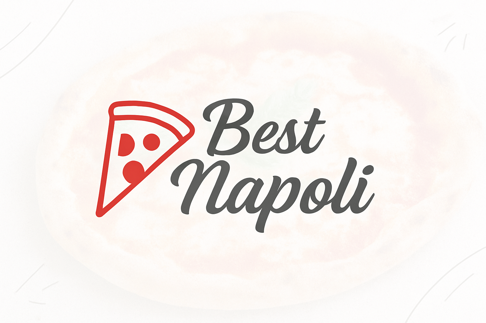

# 🍕 Pizzaria Best Napoli

Site moderno e responsivo para uma pizzaria fictícia, desenvolvido com foco em experiência do usuário, visual atrativo e funcionalidades reais como sistema de cardápio interativo e carrinho de compras.



---

## 📋 Funcionalidades

- ✅ Navegação intuitiva com menu fixo
- 📱 Design responsivo (mobile/desktop)
- 🍕 Menu dinâmico com categorias: pizzas, bebidas e sobremesas
- 🛒 Sistema de carrinho de compras com:
  - Adição e remoção de itens
  - Controle de quantidade
  - Cálculo automático do total com taxa de entrega
- 💬 Modal de carrinho elegante e funcional
- 🧾 Formulário para pedidos com dados de contato

---

## 💻 Tecnologias Utilizadas

- **HTML5**
- **Tailwind CSS**
- **JavaScript (Vanilla)**
- **Font Awesome**

---

## 🚀 Como Executar Localmente

```bash
git clone https://github.com/seu-usuario/pizzaria-best-napoli.git
cd pizzaria-best-napoli
# Abra o index.html no navegador
